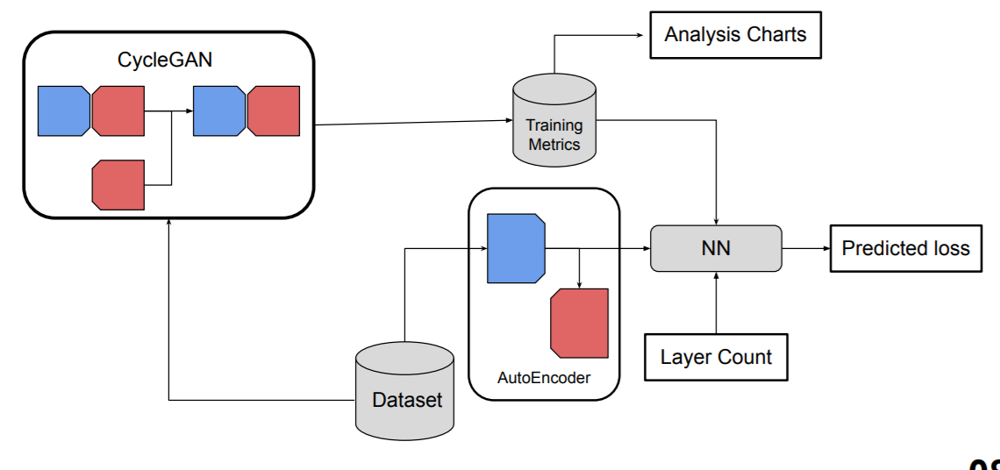
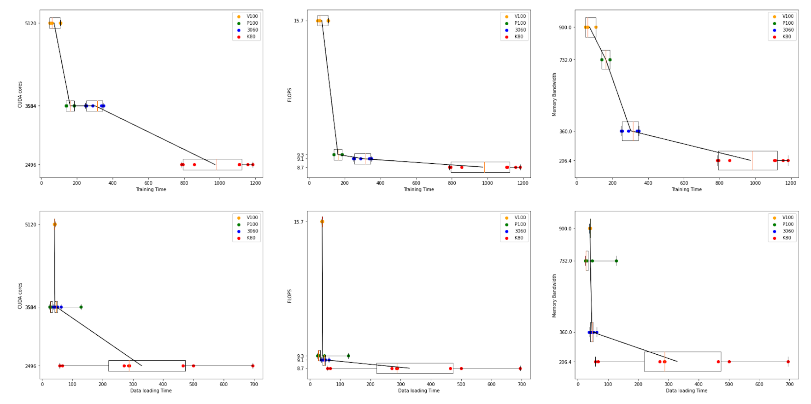
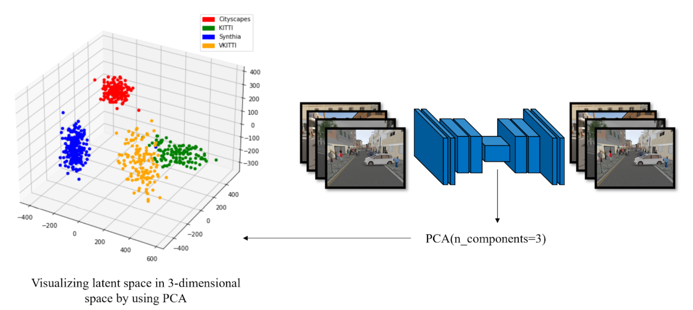

# Performance Modeling and Analysis of Unsupervised Domain Adaptation for Autonomous Driving
## Project Description:
Deep learning has become one of the widely used tools in autonomous vehicles to solve tasks like semantic segmentation and object detection. With the evergrowing size of neural networks, the demand for a massive good quality labeled dataset is high. Manually labeling datasets to train giant neural networks have practically become impossible due to the sheer growth in the network size in recent years. Sim2Real is a domain adapatation is a technique that can make use of simulators to genrate huge datatsets and transfer the model learned on simulated dataset to generalize on real datasets.With extensive work going on in the the field, it is crucial to analyse and model the performance of these networks in terms of training time, dataloading time and predicting the loss metrics.\
In this project we use CycleGAN as to peform image-to-image translation from synthetic datasets to real datasets and model the performance. The implementation details of the DL jobs that were ran to collect data are given below:

**Input-Output dataset:** VKITTI-KITTI, VKITTI-Cityscapes, Synthia-KITTI, Synthia-Cityscapes \
**GPUs used:** V100 (DGX), P100 (GCP), K80 (Colab), RTX3060 (Mobile) \
**Network configuration:** Varying ResNet block sizes in the generator network starting from 3 to 9 \
**Batch sizes:** Varying from 1 to 16
### **Solution Diagram:**


With the collected dataset, analysis was done on training and dataloading time in terms of GPU specifications such as CUDA cores, FLOPs and memory bandwidth as shown below. We can spot an inverse relationship between CUDA cores, Memory bandwidth and FLOPs with respect to training time and data-loading time. Surprisingly, memory bandwidth has less impact on the overall data loading time, indicating that CPU has significant involvment in data loading process compared to GPU processing. In spite of relatively less CUDA cores and FLOPs difference between P100 and K80, we find significant performance difference between P100 and K80s. We can also
see that consumer GPUs have comparable performance to workstation GPUs like K80 and P100, albeit lesser VRAM. From the box plots, we can see that V100, P100 and 3060 have a consistent performance across all the datasets. However, K80 has provided unreliable results with large variations.
This is due to the fact that Colab platform doesn't provide dedicated systems for end-users and are time-shared across multiple users.



Further, a neural network is used to predict the loss metrics of network given the dataset used and network congfiguration (# ResNet blocks) without training. This method alleviates some drawbacks of existing method such as TAPAS which just uses a single dataset characterization number to predict single loss metric. In our work, we using a single number to represent a dataset undermines the information in a dataset and we also have multiple loss metrics like cycle consistency loss, identity loss etc. An identity autoencoder is used to compress the information in a dataset into a latent space. This latent space along with network configuartion is used to predict loss metrics (observed MAE < 10%).



****

## Repository Description:
The ```CycleGAN``` folder contains a slightly modified version of the original CycleGAN PyTorch code. ```auto_encoder.ipynb``` contains the code to compress the datasets into a latent space and visualize them in a 3-d space as shown above. ```NN.ipynb``` contains the code of a simple fully connected network used to predict the loss metrics given the latent spaces and network configuration. ```visualize.ipynb``` contains the code for visualization of plots from the training data.

****
## Code execution sample commands:
```
cd CycleGAN
python train.py --name VKITTI-KITTI --num_layers 9 --gpu_ids 0,1 --batch_size 16

mv *.csv ../
mkdir results && mv *.csv results/
```
Use ```csvcombine.ipynb``` to prepare the csv data and use ```visualize.ipynb``` to get the charts.